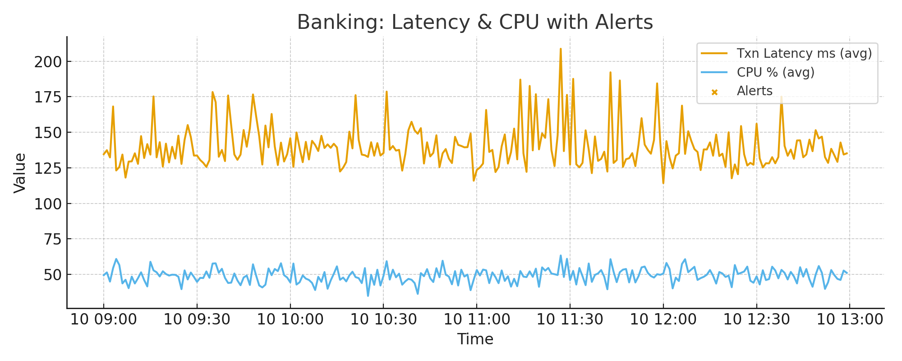
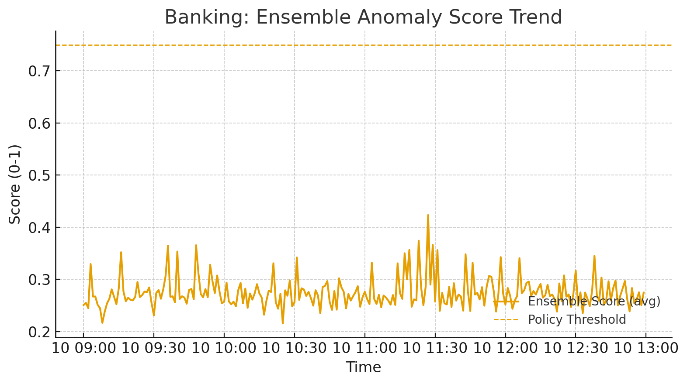
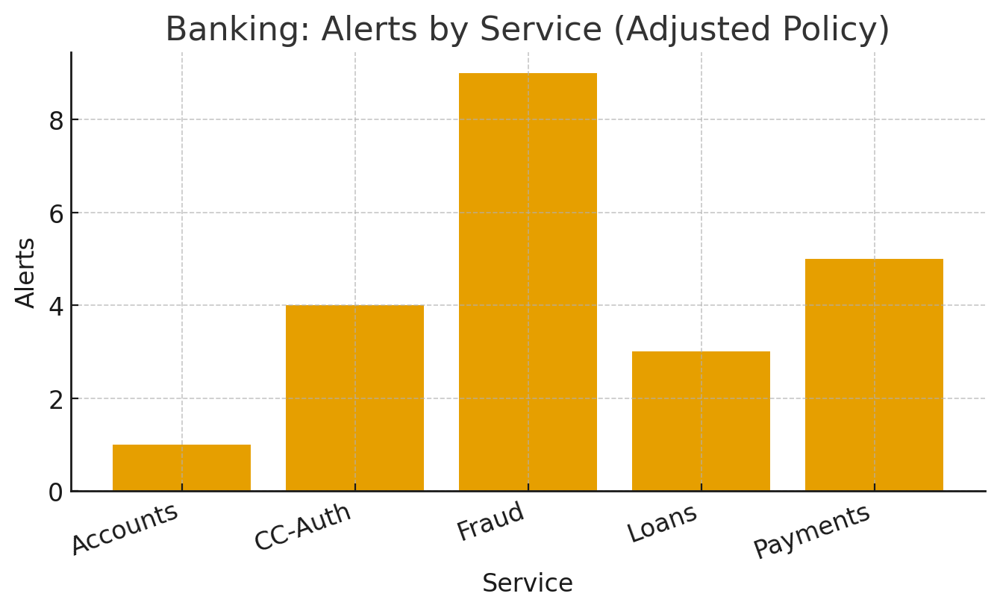
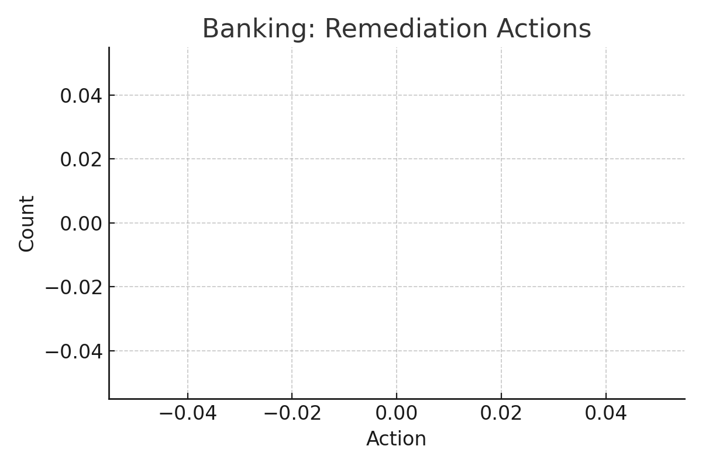
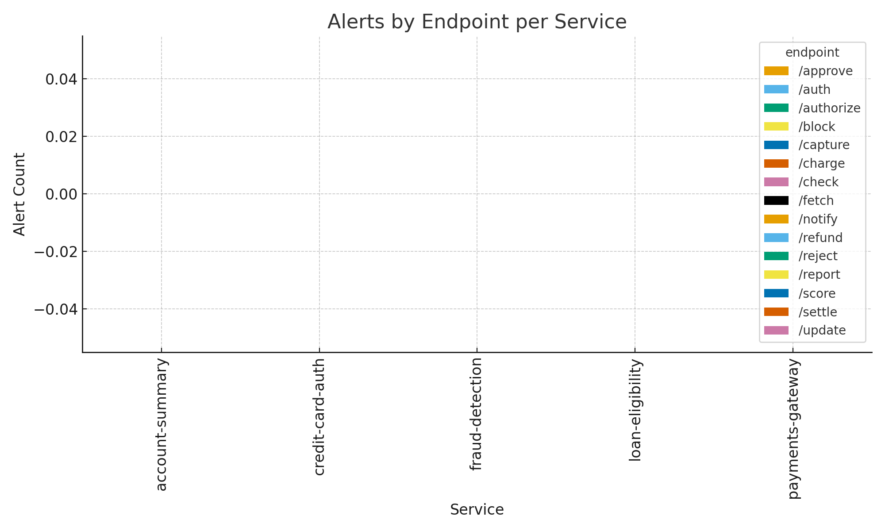
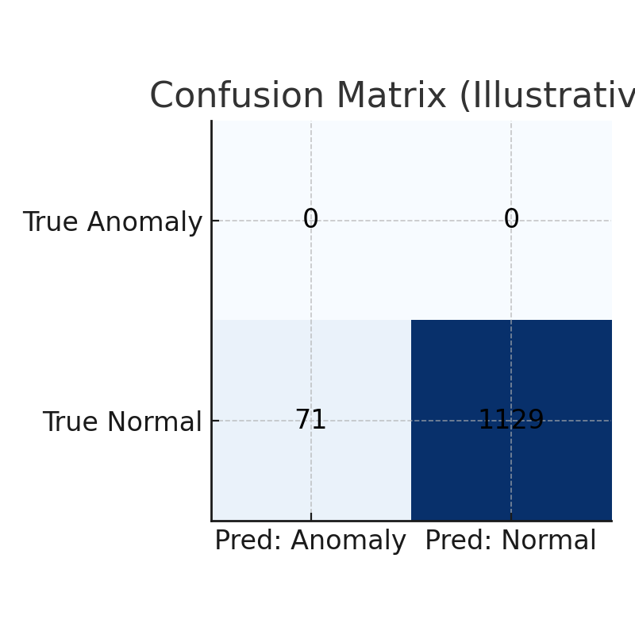

  

  
  
  

# SmartOps (Illustrative) — AI-Driven Predictive Monitoring and Anomaly Detection in DevOps Environments.

> **Purpose:** This repository demonstrates a sanitized open-source representation of an AI-driven DevOps framework (“SmartOps”). It collects telemetry, engineers features, detects anomalies, applies rules, and orchestrates automated or human-in-the-loop remediation.

---

### 🧠 AI-Driven Anomaly Detection

Using advanced machine learning models such as **Isolation Forest**, **Autoencoders**, and **Support Vector Machines (SVM)**, the SmartOps framework continuously analyzes **telemetry data**—including CPU utilization, latency metrics, and API performance indicators.

These algorithms learn the **“normal” operational baseline** through unsupervised or semi-supervised learning, dynamically adapting to workload trends and seasonal variations. Once trained, they automatically **surface deviations** that could evolve into performance degradation or system failures.

#### Model Highlights
- **Isolation Forest:** Detects rare and subtle anomalies through feature isolation.
- **One-Class SVM:** Learns a decision boundary of normal operation; flags anything outside as an outlier.
- **Autoencoder:** Uses neural reconstruction errors to capture nonlinear deviations in telemetry behavior.

#### SmartOps Workflow
1. **Ingest Data:** Collect logs and metrics from distributed environments.
2. **Feature Engineering:** Normalize, scale, and extract meaningful telemetry signals.
3. **Model Ensemble:** Evaluate through multiple detectors for robust anomaly scoring.
4. **Rules Engine:** Apply guardrails and governance policies to validate automated actions.
5. **Remediation Orchestration:** Execute or simulate corrective playbooks, ensuring safety and auditability.
6. **Feedback Loop:** Feed post-action outcomes into continuous learning.

---

### 🔧 Architecture Diagram

flowchart LR
  A[Sources: Logs & Metrics] --> B[Collectors]
  B --> C[Feature Engineering]
  C --> D1[Detector: IsolationForest]
  C --> D2[Detector: OneClass SVM]
  C --> D3[Detector: Autoencoder]
  D1 --> E[Ensemble & Scoring]
  D2 --> E
  D3 --> E
  E --> F[Rules Engine: Policies & Guardrails]
  F --> G{Action?}
  G -- yes --> H[Remediator: Playbooks, Tickets, Runbooks]
  G -- no  --> I[Observe & Notify]
  H --> J[Feedback Loop: Outcomes → Model tuning]
  I --> J

⚙️ Example Run
python examples/simulate_pipeline.py --config configs/sample_config.yaml

This runs a sanitized simulation where SmartOps analyzes synthetic logs and metrics, produces anomaly scores, applies policy logic, and runs a dry-run remediation.

📄 Licensing & Citation

© 2025 Baskaran Jeyarajan (Baskar). Licensed under Apache-2.0.

For academic references, cite using CITATION.cff.

📂 Repository Structure
smartops-framework/
├─ smartops/                  # Core modules
├─ configs/                   # YAML configs
├─ examples/                  # Simulation scripts
├─ docs/                      # Extended docs
├─ k8s/                       # Kubernetes manifests
├─ terraform/                 # Terraform IaC skeleton
├─ tests/                     # Smoke tests
├─ .github/workflows/         # CI automation
└─ LICENSE, CITATION.cff, README.md, CONTRIBUTING.md

## 🏦 Banking/Financial Evidence (Illustrative)

- **Telemetry & Scores:** see [`results_banking/banking_telemetry.csv`](results_banking/banking_telemetry.csv) and [`results_banking/banking_model_scores.csv`](results_banking/banking_model_scores.csv)
- **Latency & CPU with Alerts:**  
  
- **Ensemble Score Trend:**  
  
- **Alerts by Service:**  
  
- **Remediation Actions Summary:**  
  

## 🧩 Banking Endpoint & Validation Evidence

- **Alerts by Endpoint:**  
  

- **Confusion Matrix (Illustrative):**  
  

See detailed metrics in [`docs/banking_validation.md`](results_banking/banking_validation.md)
