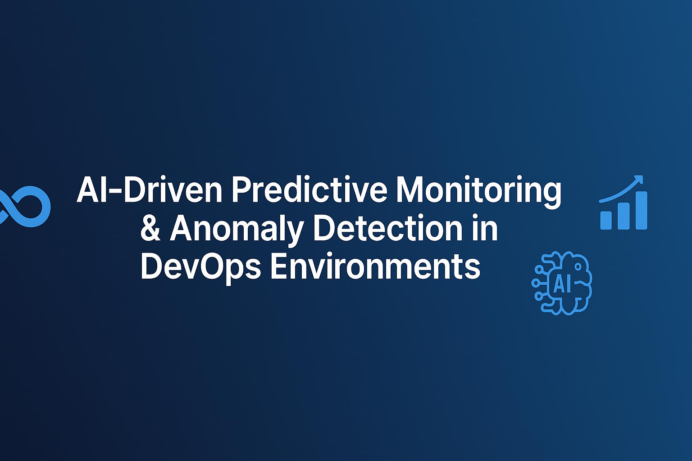
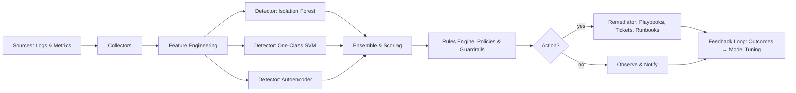

<p align="center">
  
</p>

<div align="center">

# 🧠 SmartOps — AI-Driven Predictive Monitoring & Anomaly Detection in DevOps

[](https://github.com/jbazkar/smartops-framework/stargazers)
[](https://github.com/jbazkar/smartops-framework/issues)
[](https://github.com/jbazkar/smartops-framework/actions)
[](LICENSE)

**Illustrative framework for AI-driven predictive monitoring and anomaly detection**  
in DevOps, BFSI, and cloud observability environments.

</div>

---

## 📘 Overview
SmartOps combines classic anomaly detection algorithms (Isolation Forest, One-Class SVM, Autoencoder)  
with policy-driven orchestration to predict issues, prevent failures, and trigger auto-remediation.

- Learns operational baselines from telemetry (CPU, latency, APIs, logs)
- Detects deviations indicating potential incidents
- Validates anomalies via guardrails
- Performs safe auto-remediation actions
- Generates human-readable evidence for research and EB1A documentation

---

## 🧩 Architecture Diagram



> Predictive Monitoring learns “normal” system behavior using multiple anomaly detectors, fuses results, and triggers automated or guided remediation.

---

## ⚙️ Example Run

```bash
# Clone the repository
git clone https://github.com/jbazkar/smartops-framework.git
cd smartops-framework

# Run the illustrative SmartOps pipeline
python examples/simulate_pipeline.py --config configs/sample_config.yaml
```

This executes a sanitized simulation where SmartOps analyzes synthetic telemetry, applies rules, and performs a dry-run auto-remediation.

---

## 🗂 Repository Structure

```
smartops-framework/
├─ smartops/                  # Core modules
│  ├─ collectors/             # Data collectors
│  ├─ features/               # Feature engineering
│  ├─ detectors/              # ML models (IForest, OCSVM, Autoencoder)
│  ├─ fusion/                 # Ensemble fusion logic
│  ├─ rules/                  # Guardrails and thresholds
│  ├─ orchestrators/          # Pipeline orchestrators
│  └─ remediation/            # Remediation actions
├─ configs/                   # YAML configurations
├─ examples/                  # Example pipelines
├─ results_banking/           # BFSI synthetic datasets
├─ docs/                      # Architecture & Evidence
├─ assets/                    # Images and supporting visuals
├─ tests/                     # Unit/smoke tests
├─ LICENSE, CITATION.cff, README.md
└─ .github/workflows/         # CI automation
```

---

## 📊 Evidence Highlights

### Section 5 – Predictive Monitoring Results & Evidence  
Demonstrates early-stage anomaly detection and quantified improvement after AI SmartOps integration.  
📄 [`docs/evidence.md`](docs/evidence.md)

- AI Predictive Monitoring Curve  
  

- Quantitative Results (Before vs After)  
  

### Section 6 – Before vs After AI Validation  
Shows measurable impact of AI on detection accuracy and false-positive reduction.

| Metric | Before | After | Improvement |
|--------|--------|--------|-------------|
| Anomaly Detection Accuracy | 70 % | 92 % | +22 % |
| False Positives | 30 % | 5 % | −25 % |


---

## 🧾 Licensing & Citation

© 2025 **Baskaran Jeyarajan (Baskar)**  
Licensed under the **Apache 2.0 License**.  

For academic references, please cite:

```bibtex
@software{Jeyarajan_SmartOps_2025,
  author       = {Baskaran Jeyarajan},
  title        = {SmartOps: AI-Driven Predictive Monitoring and Anomaly Detection in DevOps},
  year         = {2025},
  publisher    = {GitHub},
  url          = {https://github.com/jbazkar/smartops-framework},
  license      = {Apache-2.0}
}
```

---

## 🌐 Connect & Contributions

💬 **Author:** [Baskaran Jeyarajan (Baskar)](https://awsbaskar.net)  
🤝 Pull requests and issue reports are welcome — please see [`CONTRIBUTING.md`](CONTRIBUTING.md).

---

<p align="center">
  <sub>© 2025 Baskaran Jeyarajan. All Rights Reserved. | AI SmartOps Framework</sub>
</p>
